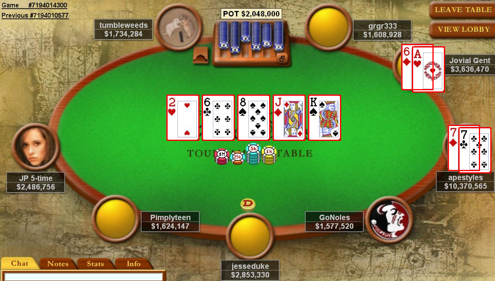

SubImage
========

Simple tooling to detect an image in another image. Origially coded to locate, for example, reel symbols on screenshots of video slots. Or detect and identify poker cards on screenshots of poker play.
Installation provides a small library of python functions and UNIX-like command line tools to find images within other images.
Package has dependencies upon python packages numpy, scipy, opencv (cv2) and argparse. Have run it on windows, but is primarily developed and tested in linuxmint 16.


Installation
============
To install, point pip to this github:
```
pip install git+https://github.com/johnoneil/subimage
```

Command Line Tools
==================
Once installed, the package makes two command line tools available:
* subimage-find
* subimage-find-aspect-ratio

subimage-find
=============
Tool finds images in other images. Invoked in the form:
```
subimage-find -v mega_fruits.jpg cherry.png -o subimage_test.png
```
Which will find all instances of cherry.png within the primary image mega fruits.jpg and write its output to subimage_test.png.
There is an optional argument --confidence (value 0.0 to 1.0) which can be adjusted to fine tune search results.
The command above generated the image below. Found instances of the cherry.png image within the larger image are outlined in RED.


subimage-find-aspect-ratio
==========================
Fid graphical elements (really connected components) within a primary image by their rectangular bounding box aspect ratio. Invoked in the form:
```
subimage-find-aspect-ratio poker.jpg --aspect 0.7 --error 0.03 -v
```
The above command generated output as below (cards in the image are of aspect ratio 0.7+/-0.03).Found instances of graphical element with the required aspect ratio are outlined in RED.

